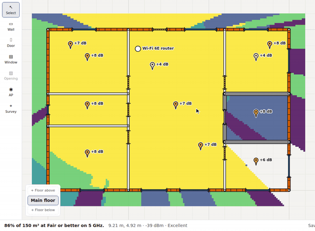
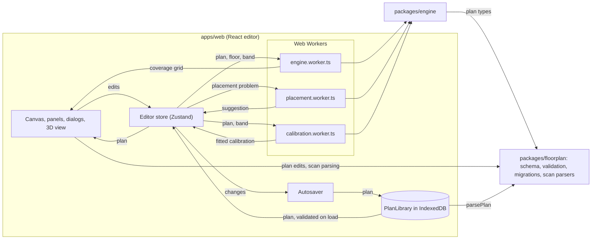

<div align="center">

# SignalPlan

**Plan your home's Wi-Fi before you buy a single router.**

Draw your floor plan to scale, drop in access points, and see predicted coverage on 2.4, 5 and 6 GHz, floor by floor, in 2D and 3D.<br>
Then let the optimizer tell you where they should go and how many you need.

[](https://github.com/NC4321/SignalPlan/actions/workflows/ci.yml) [](https://github.com/NC4321/SignalPlan/releases) [](LICENSE) [](tsconfig.base.json)

### [Open SignalPlan →](https://signalplan.pages.dev)

Free · Runs in your browser · No account · Plans stay on your device

<br>


</div>

<br>

<table>
  <tr>
    <td width="50%" valign="top">
      
      <h3>Smart placement</h3>
      Find the best spot for your router, add one more access point, or ask how many you need to hit a coverage goal.
    </td>
    <td width="50%" valign="top">
      
      <h3>Whole-home 3D</h3>
      Stack floors, cut stairwells, and see how signal passes between storeys in an interactive 3D view.
    </td>
  </tr>
  <tr>
    <td width="50%" valign="top">
      
      <h3>Roaming, overlap and channels</h3>
      See which access point a phone would use, where they compete and where they interfere, then plan channels so they don't.
    </td>
    <td width="50%" valign="top">
      
      <h3>Check it against your home</h3>
      Place a scan of your Wi-Fi at a spot, see how far the prediction is off, then calibrate the model to your walls.
    </td>
  </tr>
</table>

## Features

### Draw your home

- **Walls to scale** with snapping, typed lengths and angles, and seven materials: drywall, brick, concrete, glass, low-E glass, wood and metal.
- **Doors and windows** that slide along walls, including open doorways.
- **Trace a floor plan** from a PNG, JPEG or WebP image: set its scale with two clicks and draw over it.
- **Metric or imperial**, with undo and redo for every edit.

### See your coverage

- **Live heatmap** on 2.4, 5 or 6 GHz that updates while you drag an access point, with a colour-blind-safe legend.
- **Coverage summary**: the share of your floor area that reaches Excellent, Good, Fair or Weak.
- **Access points** with their own mounting height, bands, transmit power, and channel and width per radio.
- **Channels by region** (United States or European Union), with an option for 5 GHz DFS channels.
- **Overlap and Roaming views**, with defaults taken from Apple's roaming rules for iPhone and iPad.
- **Interference view**: signal to interference and noise (SINR) in each spot, banded by the Wi-Fi rate it allows, so you can see where access points on the same or overlapping channels get in each other's way, with your neighbours' networks typed in as background interference.
- **Channel planner** that suggests a channel and width for every radio, so access points that hear each other don't share one, with a reason for each.

### Check it against your home

- **Survey spots**: click where you measured signal and enter each access point's reading in dBm, or import a CSV or JSON file of readings.
- **Scan your network**: copy the scan command for Windows, macOS or Linux (or export a scan on Android with WiFi Analyzer), paste what it prints, then say which devices are yours and which are a neighbour's. A scan can be placed at a survey spot, where it becomes that spot's readings; signal given as a percentage is converted to dBm and marked approximate.
- **Error report**: each pin shows how far the prediction is from your reading, coloured by size, with a table of the mean and RMS error per band.
- **Calibrate** fits the model to your readings, band by band: how fast signal fades, the phone's offset, and the loss of each wall and floor material the readings cross, all within limits taken from published measurements. It previews the fit on the map and shows the error before and after; Apply keeps it (one undo step) and Reset to defaults undoes it.
- **Located neighbours**: a neighbour's network heard at three survey spots or more can be placed on the plan, with a circle for how sure the position is, and then counts in the Interference view and the channel plan where it actually is.

### Plan the whole home

- **Multiple floors**, basements included, over timber joist or concrete slab floors.
- **Stairwells and atriums** where signal skips the floor loss.
- **Floor below shown faintly** while you draw, so walls line up between storeys.
- **3D view** of every floor and its heatmap, which you can rotate, zoom and spread apart.

### Let it place access points

- **Suggest a spot** for one access point, previewed on the heatmap before you apply it.
- **Several at once**: move every access point together, or add one more.
- **How many do I need?** Pick a goal from 80 to 100% of the floor and it finds the fewest access points that reach it, up to four added.
- **Lock** access points that can't move, such as the router where the line comes in.

### Keep and share it

- **Autosaves in your browser**, with a list of your plans.
- **Save and open** `.signalplan.json` files.
- **Share a link** with the plan in it; nothing is uploaded.
- **Export a PNG** of the floor with its heatmap, legend, coverage summary and scale bar.
- **Keyboard and screen-reader support**, with every shortcut a ? away, and a layout that works on phones.
- **A short guided first run** over the sample home on your first visit, shown once and replayed from the shortcuts dialog.
- **Says when it can't save**: a steady notice appears if your changes aren't being kept in this browser.

## How the model works

For each cell of the floor, SignalPlan starts from how much a radio's signal fades over open air, then takes off a fixed amount for every wall the straight line from the access point to that cell passes through, and for any floor it crosses. What a wall or floor takes off depends on what it is made of and on the band: a drywall partition costs a few dB, a concrete wall many more. The strongest access point sets the cell's colour, and the same grid feeds the coverage summary, the overlap, roaming and interference views, the channel planner and the optimizer. Calibrating swaps the defaults for values fitted to your own readings.

**[docs/HOW-IT-WORKS.md](docs/HOW-IT-WORKS.md)** explains this without the maths, with diagrams. **[docs/MODEL.md](docs/MODEL.md)** has the equations, the sources and the tests.

### Built on published measurements

SignalPlan's predictions come from a documented model, not guesswork. Every material loss and constant is traced to a primary source, and the model is tested against published measurements.

- **Wall and floor losses** are computed from the electrical properties in [ITU-R P.2040](https://www.itu.int/rec/R-REC-P.2040), using layered constructions such as drywall on studs or a brick veneer.
- **Checked against lab measurements** from NIST, Shakya et al., and Muqaibel at Virginia Tech. Drywall and glass agree with NIST within 2.3 dB at 5 and 6 GHz and within 1 dB at 2.0 GHz, and a wooden door and glass agree with Muqaibel within about 0.5 dB.
- **Checked against the ITU-R P.1238-13 indoor model.** A two-storey test home stays within 1 dB of it on the main floor, and within 0.7 dB (2.4 GHz) and 3.4 dB (5 GHz) upstairs.
- **Honest about its limits.** The model follows the straight line from each access point and ignores reflections and diffraction, so areas behind strong walls look darker than they are. It under-predicts the loss of some wood by up to 5 dB. Predictions haven't yet been checked against measurements in a real home. [All known limits →](docs/MODEL.md#known-limits)

Every design choice and its reasoning is recorded in the [decision log](docs/DECISIONS.md).

## Releases

| Version                                                            | Milestone       | Highlights                                                                        |
| ------------------------------------------------------------------ | --------------- | --------------------------------------------------------------------------------- |
| [v0.3.0](https://github.com/NC4321/SignalPlan/releases/tag/v0.3.0) | Whole home      | Multiple floors, signal between floors, stairwells, 3D view                       |
| [v0.2.0](https://github.com/NC4321/SignalPlan/releases/tag/v0.2.0) | Smart placement | Placement optimizer, several access points, "How many do I need?", locking        |
| [v0.1.0](https://github.com/NC4321/SignalPlan/releases/tag/v0.1.0) | Single floor    | Walls to scale, doors and windows, tracing, heatmap, coverage summary, PNG export |

Channels by region, channel and width per radio, the Overlap and Roaming views, the Interference view, neighbours' networks and the channel planner are on `main` and live on the site, ahead of the next release. See the [changelog](CHANGELOG.md) for details and the [milestones](https://github.com/NC4321/SignalPlan/milestones) for what's next.

## Roadmap

The plan is in [docs/OUTLINE.md](docs/OUTLINE.md), one phase at a time.

**Shipped**

- **Phases 1 and 3**: the floor plan editor and live heatmap, with the coverage summary and PNG export.
- **Phase 2**: the propagation engine, with its sources and tests.
- **Phase 4**: the placement optimizer, several access points, "How many do I need?".
- **Phase 5**: multiple floors, signal between floors, stairwells, the 3D view.
- **Phase 6**: overlap, roaming and interference views, channels by region, the channel planner.
- **Phase 7**: survey spots, the error report and Calibrate.
- **Phase 8**: Scan your network, scans placed at spots, located neighbours.
- **Phase 9, so far**: a sample home and guided first run, empty and error states, keyboard shortcuts, share links, and this README.

**Next**, the rest of Phase 9: a short write-up on the physics and the optimizer ([#161](https://github.com/NC4321/SignalPlan/issues/161)), launch posts ([#162](https://github.com/NC4321/SignalPlan/issues/162)), and the exit gate: a stranger lands on the demo, understands it in 30 seconds and plans a room without help, tested with first-time users ([#163](https://github.com/NC4321/SignalPlan/issues/163)).

**Still open: checks in a real home.** Calibration lowering the error on a real home ([#132](https://github.com/NC4321/SignalPlan/issues/132)), and scanning your own network from a laptop and a phone, then planning from it ([#144](https://github.com/NC4321/SignalPlan/issues/144)). Both are tested on synthetic homes only so far.

## For developers

SignalPlan is a TypeScript monorepo of three parts: a React editor, a propagation engine with no DOM, and a floor plan package that defines and checks the plan.

### Architecture



The editor keeps the plan in one store, and every edit goes through it. The autosaver watches the store and saves the plan to the library (IndexedDB) a moment after the last change. The coverage worker takes a plan, a floor and a band and returns a grid, which the 2D canvas, the 3D view, the summaries and the PNG export read. The placement and calibration workers take a plan and return a suggestion or a fit, which waits in the store as a preview until you apply it. A few quick engine functions (a floor's grid for drawing, the channel planner, locating a neighbour) also run on the main thread.

The rules that hold it together:

- The engine and the floor plan package have no DOM or React, so the engine runs in Web Workers and the heatmap keeps updating while a search runs.
- A plan is migrated and validated against the schema every time it is loaded: from a file, a share link, the library or the sample home.
- Nothing leaves the browser: plans live in IndexedDB, share links carry the plan in the part of the address after `#`, and scans are pasted in by you.
- Every view reads the same coverage grid, so they can't disagree.

| Path                 | Contents                                                                                                             |
| -------------------- | -------------------------------------------------------------------------------------------------------------------- |
| `apps/web`           | React + Vite editor, Canvas 2D, three.js 3D view                                                                     |
| `packages/engine`    | Propagation engine and placement optimizer, pure TypeScript                                                          |
| `packages/floorplan` | Floor plan JSON schema (Zod), validation, migrations, scan parsers and test homes                                    |
| `docs/`              | [Model](docs/MODEL.md), [file format](docs/FLOORPLAN.md), [decisions](docs/DECISIONS.md), [outline](docs/OUTLINE.md) |

Requires Node 24+ and pnpm.

```sh
pnpm install
pnpm dev                              # start the web app
pnpm check                            # typecheck, lint, format check and unit tests
pnpm --filter @signalplan/web e2e     # browser tests (Playwright)
```

The demo GIFs are recorded by [`scripts/record-demo.mjs`](scripts/record-demo.mjs). Contributions are welcome; see [CONTRIBUTING.md](CONTRIBUTING.md).

## License

[MIT](LICENSE) © 2026 Nathan
