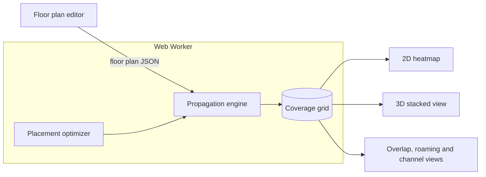

# SignalPlan

[](https://github.com/NC4321/SignalPlan/actions/workflows/ci.yml)
[](LICENSE)

A free, browser-based Wi-Fi coverage planner. Draw your home to scale, place access points, and see predicted coverage floor by floor, then let the tool suggest better placements.

> **Status:** early development. See the [roadmap](#roadmap).

**Live demo:** <https://signalplan.pages.dev>

## Architecture

The propagation engine is plain TypeScript with no DOM or React dependency. The editor writes a versioned JSON floor plan; the engine turns it into a coverage grid inside a Web Worker; every view reads that grid.



| Path              | Contents                                                                 |
| ----------------- | ------------------------------------------------------------------------ |
| `apps/web`        | React + Vite front end                                                   |
| `packages/engine` | RF propagation engine: pure TypeScript, unit tested                      |
| `docs/`           | [Project outline](docs/OUTLINE.md) and [decision log](docs/DECISIONS.md) |

## Getting started

Requires Node 24+ and pnpm.

```sh
pnpm install
pnpm dev      # start the web app
pnpm check    # typecheck, lint, format check and tests
```

## Roadmap

| Milestone            | Features                                                 |
| -------------------- | -------------------------------------------------------- |
| M1: Single-floor MVP | Wall drawing to scale, materials, AP placement, heatmap  |
| M2: Smart placement  | Placement optimizer, multi-AP and mesh suggestions       |
| M3: Whole home       | Multiple floors, floor attenuation, 3D stacked view      |
| M4: Pro features     | Overlap and roaming, channel planning, phone calibration |

Progress is tracked in [GitHub milestones](https://github.com/NC4321/SignalPlan/milestones). The full plan is in [docs/OUTLINE.md](docs/OUTLINE.md).

## License

[MIT](LICENSE)
