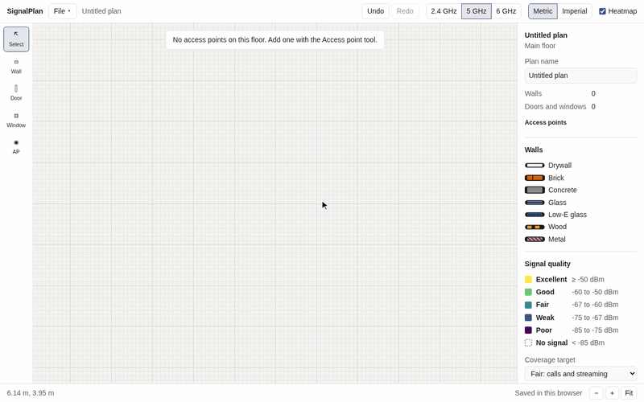
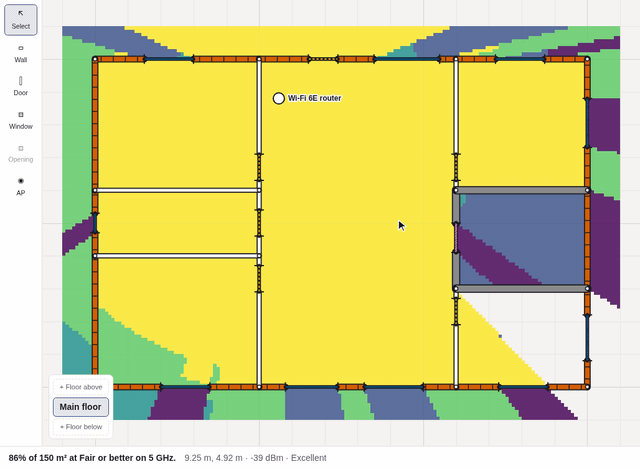
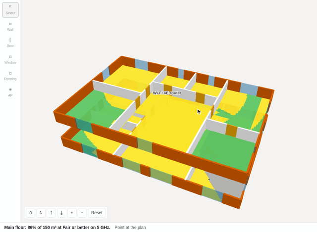
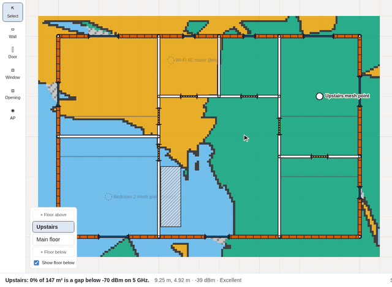
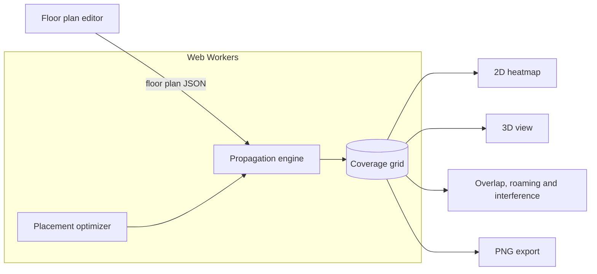

<div align="center">

# SignalPlan

**Plan your home's Wi-Fi before you buy a single router.**

Draw your floor plan to scale, drop in access points, and see predicted coverage on 2.4, 5 and 6 GHz, floor by floor, in 2D and 3D.<br>
Then let the optimizer tell you where they should go and how many you need.

[](https://github.com/NC4321/SignalPlan/actions/workflows/ci.yml) [](https://github.com/NC4321/SignalPlan/releases) [](LICENSE) [](tsconfig.base.json)

### [Open SignalPlan →](https://signalplan.pages.dev)

Free · Runs in your browser · No account · Plans stay on your device

<br>



</div>

<br>

<table>
  <tr>
    <td width="33%" valign="top">
      
      <h3>Smart placement</h3>
      Find the best spot for your router, add one more access point, or ask how many you need to hit a coverage goal.
    </td>
    <td width="33%" valign="top">
      
      <h3>Whole-home 3D</h3>
      Stack floors, cut stairwells, and see how signal passes between storeys in an interactive 3D view.
    </td>
    <td width="33%" valign="top">
      
      <h3>Overlap and roaming</h3>
      See where access points compete, which one a phone would use, and where it would switch.
    </td>
  </tr>
</table>

## Features

### Draw your home

- **Walls to scale** with snapping, typed lengths and angles, and seven materials: drywall, brick, concrete, glass, low-E glass, wood and metal.
- **Doors and windows** that slide along walls, including open doorways.
- **Trace a floor plan** from a PNG, JPEG or WebP image: set its scale with two clicks and draw over it.
- **Metric or imperial**, with undo and redo for every edit.

### See your coverage

- **Live heatmap** on 2.4, 5 or 6 GHz that updates while you drag an access point, with a colour-blind-safe legend.
- **Coverage summary**: the share of your floor area that reaches Excellent, Good, Fair or Weak.
- **Access points** with their own mounting height, bands, transmit power, and channel and width per radio.
- **Channels by region** (United States or European Union), with an option for 5 GHz DFS channels.
- **Overlap and Roaming views**, with defaults taken from Apple's roaming rules for iPhone and iPad.
- **Interference view**: signal to interference and noise (SINR) in each spot, banded by the Wi-Fi rate it allows, so you can see where access points on the same or overlapping channels get in each other's way.

### Plan the whole home

- **Multiple floors**, basements included, over timber joist or concrete slab floors.
- **Stairwells and atriums** where signal skips the floor loss.
- **Floor below shown faintly** while you draw, so walls line up between storeys.
- **3D view** of every floor and its heatmap, which you can rotate, zoom and spread apart.

### Let it place access points

- **Suggest a spot** for one access point, previewed on the heatmap before you apply it.
- **Several at once**: move every access point together, or add one more.
- **How many do I need?** Pick a goal from 80 to 100% of the floor and it finds the fewest access points that reach it, up to four added.
- **Lock** access points that can't move, such as the router where the line comes in.

### Keep and share it

- **Autosaves in your browser**, with a list of your plans.
- **Save and open** `.signalplan.json` files.
- **Export a PNG** of the floor with its heatmap, legend, coverage summary and scale bar.
- **Keyboard and screen-reader support**, and a layout that works on phones.

## Built on published measurements

SignalPlan's predictions come from a documented model, not guesswork. Every material loss and constant is traced to a primary source, and the model is tested against published measurements. The full write-up is in **[docs/MODEL.md](docs/MODEL.md)**.

- **Wall and floor losses** are computed from the electrical properties in [ITU-R P.2040](https://www.itu.int/rec/R-REC-P.2040), using layered constructions such as drywall on studs or a brick veneer.
- **Checked against lab measurements** from NIST, Shakya et al., and Muqaibel at Virginia Tech. Drywall and glass agree with NIST within 2.3 dB at 5 and 6 GHz and within 1 dB at 2.0 GHz, and a wooden door and glass agree with Muqaibel within about 0.5 dB.
- **Checked against the ITU-R P.1238-13 indoor model.** A two-storey test home stays within 1 dB of it on the main floor, and within 0.7 dB (2.4 GHz) and 3.4 dB (5 GHz) upstairs.
- **Honest about its limits.** The model follows the straight line from each access point and ignores reflections and diffraction, so areas behind strong walls look darker than they are. It under-predicts the loss of some wood by up to 5 dB. Predictions haven't yet been checked against measurements in a real home. [All known limits →](docs/MODEL.md#known-limits)

Every design choice and its reasoning is recorded in the [decision log](docs/DECISIONS.md).

## Releases

| Version                                                            | Milestone       | Highlights                                                                        |
| ------------------------------------------------------------------ | --------------- | --------------------------------------------------------------------------------- |
| [v0.3.0](https://github.com/NC4321/SignalPlan/releases/tag/v0.3.0) | Whole home      | Multiple floors, signal between floors, stairwells, 3D view                       |
| [v0.2.0](https://github.com/NC4321/SignalPlan/releases/tag/v0.2.0) | Smart placement | Placement optimizer, several access points, "How many do I need?", locking        |
| [v0.1.0](https://github.com/NC4321/SignalPlan/releases/tag/v0.1.0) | Single floor    | Walls to scale, doors and windows, tracing, heatmap, coverage summary, PNG export |

Channels by region, channel and width per radio, the Overlap and Roaming views, and the Interference view are on `main` and live on the site, ahead of the next release. See the [changelog](CHANGELOG.md) for details and the [milestones](https://github.com/NC4321/SignalPlan/milestones) for what's next.

## For developers

SignalPlan is a TypeScript monorepo. The propagation engine is plain TypeScript with no DOM or React, so it runs in Web Workers. The editor writes a versioned JSON floor plan, the engine turns it into a coverage grid, and every view reads that grid.



| Path                 | Contents                                                                                                             |
| -------------------- | -------------------------------------------------------------------------------------------------------------------- |
| `apps/web`           | React + Vite editor, Canvas 2D, three.js 3D view                                                                     |
| `packages/engine`    | Propagation engine and placement optimizer, pure TypeScript                                                          |
| `packages/floorplan` | Floor plan JSON schema (Zod), migrations and test homes                                                              |
| `docs/`              | [Model](docs/MODEL.md), [file format](docs/FLOORPLAN.md), [decisions](docs/DECISIONS.md), [outline](docs/OUTLINE.md) |

Requires Node 24+ and pnpm.

```sh
pnpm install
pnpm dev                              # start the web app
pnpm check                            # typecheck, lint, format check and unit tests
pnpm --filter @signalplan/web e2e     # browser tests (Playwright)
```

The demo GIFs are recorded by [`scripts/record-demo.mjs`](scripts/record-demo.mjs). Contributions are welcome; see [CONTRIBUTING.md](CONTRIBUTING.md).

## License

[MIT](LICENSE) © 2026 Nathan
