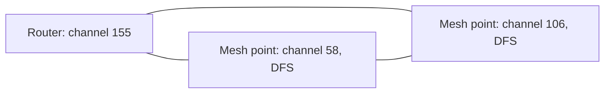
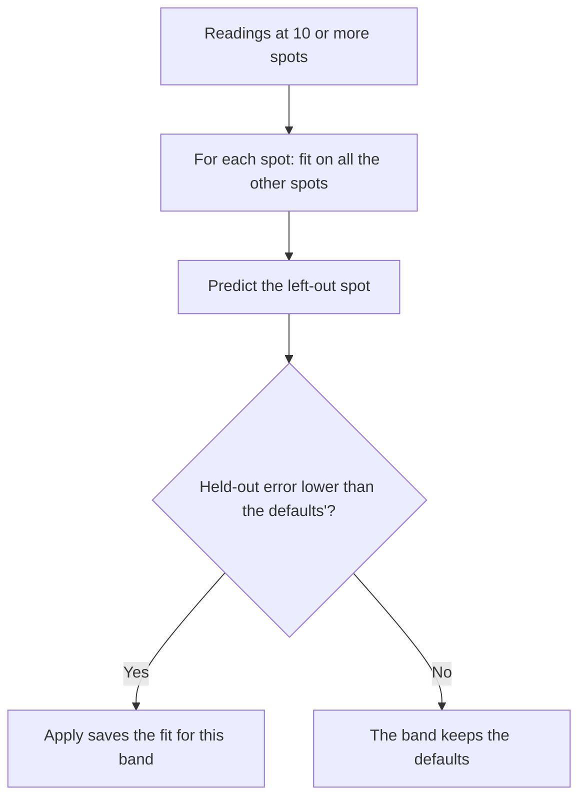
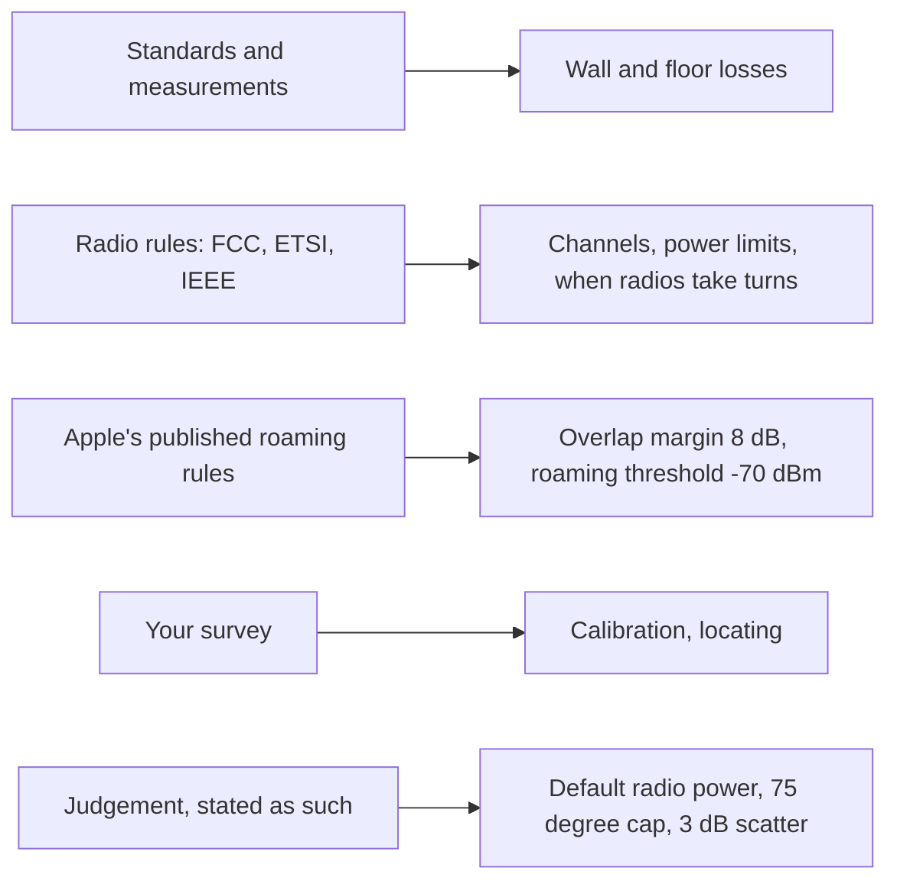

# How SignalPlan works

SignalPlan draws a map of the Wi-Fi signal in your home. This page explains how it works out that map, without assuming you know anything about radio. Each section ends with a link to [MODEL.md](MODEL.md), which has the same story with the maths, the sources and the tests.

A note on units. Signal strength is given in **dBm**. It's a scale where a bigger number is stronger, and since the numbers are negative, one closer to zero is stronger: −40 dBm is stronger than −60. Every 10 dB is ten times the power and every 3 dB is double, so a drop of 3 dB halves the signal. Nothing here needs more than that.

## 1. What the heatmap is

The heatmap is a **prediction**, not a measurement. SignalPlan never listens to your Wi-Fi to draw it. It takes the plan you drew (walls and what they are made of, floors, where the access points stand) and works out, for a point every 10 cm across each floor, how strong the signal from each access point should be there. It keeps the strongest and colours the point.


The colours step down at fixed levels: Excellent from −50 dBm, Good from −60, Fair from −67, Weak from −75 and Poor from −85. Below that a point is left uncoloured. The model assumes a phone held 1 m above the floor, with an antenna that neither boosts nor weakens the signal, which is typical of a phone.

Because it's a prediction, it can be wrong, and the later sections say where and by how much. The way to find out for your own home is to measure a few spots and compare (section 8).

A worked example. A router that sends at 23 dBm on 5 GHz, with nothing in the way, gives −44.3 dBm at 10 m. That's Excellent.

The maths and sources: [MODEL.md › The equation](MODEL.md#the-equation) and [From equation to heatmap](MODEL.md#from-equation-to-heatmap).

## 2. Distance and the path loss exponent

Signal spreads out as it travels, so it gets weaker with distance. The rule is the same one that makes a lamp look dimmer across the room. In open air, every time the distance doubles, the signal loses 6 dB, which is three-quarters of the power. Doubling from 1 m to 2 m costs as much as doubling from 8 m to 16 m, so the loss grows quickly near the access point and slowly far away. On a chart with distance on a log scale, that's a straight line.


The steepness is set by the **path loss exponent**, written n. SignalPlan uses n = 2, the open-air value, as its default, because it counts walls one at a time and so doesn't need a bigger exponent to stand in for them. If a home's readings say the signal falls faster or slower, [calibration](#8-checking-against-your-home) can change n, within limits taken from a published indoor model (1.47 to 2.39).

In words, the whole prediction is: the access point's power, less the loss in the first metre, less the loss from distance, less the cost of every wall and floor in the way.

```text
signal = radio power − loss at 1 m − 10 × n × log10(distance in metres) − walls and floors
```

An example, from the formula with 5 GHz's defaults (a 23 dBm radio, 47.3 dB lost in the first metre, n = 2): −24.3 dBm at 1 m, −44.3 at 10 m and −50.3 at 20 m. With n = 3 it would be −54.3 at 10 m, 10 dB lower.

Distance is measured in 3D, from the access point's mounting height to the phone's. Within 1 m of an access point, the 1 m value is used.

The maths and sources: [MODEL.md › The equation](MODEL.md#the-equation).

## 3. Walls: materials and how much each costs

A wall takes some of the signal that crosses it. How much depends on what it is made of. SignalPlan has seven materials, each standing for a typical North American construction: a drywall stud wall, a brick veneer wall, 200 mm of poured concrete, double glazing, low-E glazing, a solid wooden door and a steel door.

It doesn't look the losses up in a table of guesses. Each wall is built from its layers (for drywall: plasterboard, an air gap, plasterboard) using the electrical properties of each layer from an international standard, and the loss is calculated from how radio waves pass through layered slabs. The results at 5 GHz:

| Material    | Loss per wall crossed, 5 GHz |
| ----------- | ---------------------------- |
| Wooden door | 1.8 dB                       |
| Drywall     | 2.4 dB                       |
| Glass       | 6.1 dB                       |
| Brick       | 9.0 dB                       |
| Concrete    | 26.5 dB                      |
| Low-E glass | 29.9 dB                      |
| Steel door  | 40 dB                        |

Two of these show where a physics model is not enough. Energy-efficient windows have a metal coating that the standard has no data for, so its strength was fitted to one published measurement of 29.7 dB. And metal is capped at 40 dB, because a perfect conductor would block everything and real signal leaks round the edges.


**The angle that matters.** A wall is charged its head-on loss however the signal meets it. That was a choice (D30): paths meet walls at every angle, and using the angle moved the median cell by no more than 0.5 dB, and some materials lose less when the signal is slanted. It's different for floors, which the next section explains.

A worked example from the picture. A phone 8 m from a 23 dBm access point on 5 GHz, with a drywall wall and a brick wall between them. Distance alone gives −42.4 dBm. The walls take 2.4 and 9.0 dB, so the phone sees −53.8 dBm. A concrete wall in place of the brick would have taken 26.5 dB, and the phone would be at −71.3 dBm.

Where a path touches a corner or the edge of a door, the wall counts once, using the lossier material.

The maths and sources: [MODEL.md › Wall materials](MODEL.md#wall-materials), with the per-band numbers in [Loss per wall crossing](MODEL.md#loss-per-wall-crossing-db).

## 4. Floors

Between storeys the signal still takes one straight line, from the access point to the phone, and pays for each floor it crosses. A floor is built up from layers like a wall: a timber joist floor is a chipboard subfloor, an air gap the depth of the joists and a plasterboard ceiling. A concrete slab is 150 mm of concrete.

What makes floors different from walls is the angle. A phone directly above the router has the signal cross the floor straight on. A phone in a room at the far end of the storey above gets a very slanting path, which spends longer inside the floor and loses more. Storeys are about 2.7 m high, so a phone 10 m across is reached at 75° from the vertical, which is shallow.


SignalPlan works out the floor's loss at the angle of each path (D60), up to 75°. For a timber floor on 5 GHz that is 2.7 dB straight up, 4.2 dB at 60° and 6.6 dB at 75°. A concrete slab goes from 20.2 dB to 23.4 dB. Past about 80° the loss climbs steeply, but real signal also finds other ways upstairs (a stairwell, a window, the edge of the slab), so the model stops at 75°. That cap is a judgement, not a measurement.

Stairwells and other openings you draw in a floor are skipped when the path goes through them. Roofs aren't modelled.

How good is it? On the sample two-storey house on 5 GHz, the model predicts 3.4 dB more signal upstairs than a published indoor model with a floor allowance, and 0.7 dB more on 2.4 GHz. Before the angle was added the gaps were 5.5 dB (5 GHz) and 2.3 dB (2.4 GHz).

The maths and sources: [MODEL.md › Floor materials](MODEL.md#floor-materials), [Slabs at an angle](MODEL.md#slabs-at-an-angle) and [Signal between floors](MODEL.md#signal-between-floors).

## 5. Bands: why 2.4, 5 and 6 GHz differ

Wi-Fi uses three bands, and they behave differently for two reasons.

First, higher frequencies lose more in the first metre. The model's loss at 1 m is 40.2 dB on 2.4 GHz, 47.3 dB on 5 GHz and 48.7 dB on 6 GHz. Second, most walls cost more at higher frequencies. Concrete takes 14.7 dB on 2.4 GHz, 26.5 dB on 5 GHz and 29.9 dB on 6 GHz. Glass is nearly invisible at 2.4 GHz (0.5 dB) because a 3 mm pane is tiny next to the 12 cm wavelength, and costs 6.1 and 8.3 dB higher up.


Drywall is the exception: its two sheets of plasterboard help each other at 6 GHz, so it costs less there (1.4 dB) than at 2.4 GHz (2.9 dB).

So in this model 2.4 GHz reaches further through a home than the higher bands. The default radio power also differs by band: 20 dBm on 2.4 GHz, 23 dBm on 5 GHz and 18 dBm on 6 GHz. The first two are assumptions, typical of consumer routers and well under the legal limits. The 6 GHz one is the low-power indoor limit. You can set any radio's power in the plan.

Take the same 10 m and one concrete wall, with each band's default power. On 2.4 GHz the phone sees −54.9 dBm. On 5 GHz it sees −70.8 dBm, 15.9 dB less, which moves that spot from Good to Weak.

The maths and sources: [MODEL.md › Bands](MODEL.md#bands) and [Loss per wall crossing](MODEL.md#loss-per-wall-crossing-db).

## 6. Overlap, roaming and interference

The heatmap can show four maps. The first, Signal, is the one above. The other three ask a different question: what happens when more than one access point is involved.

**Overlap** counts how many access points compete for a phone at each spot. It counts those within 8 dB of the strongest one that are also at or above −70 dBm. Where two or more count, a phone there could use either, which is what you want where it moves from one to another, and a waste where it doesn't.

**Roaming** colours each spot by the access point a phone would be on (the strongest one), and draws a line where that changes. Spots where none reaches −70 dBm are hatched grey. Those two numbers, 8 dB and −70 dBm, are the figures Apple publishes for when an iPhone moves to another access point. They're used as fixed defaults for every spot, which is a simplification of what a real phone does, and you can change them per plan.

**Interference** shows, in dB, how far the strongest access point stands above everything else on the same airwaves: the other access points and any neighbours' networks, plus a floor of background noise. Where that gap is small, the signal is there, but it is drowned out.

What counts as "on the same airwaves" is the part people find confusing, so here is the picture. A channel is a slice of the radio spectrum, and radios on slices that overlap interfere. On 2.4 GHz channels 1 and 3 overlap by half, while 1 and 6 don't touch. On 5 GHz, wider channels are made by gluing 20 MHz slices together: two 20 MHz channels side by side (36 and 44, say) are apart, but inside one 80 MHz channel (42) they clash.


For the sums, a radio's power is taken as spread evenly across its channel, so the share that lands in your channel is the shared MHz over its width: channels 1 and 3 share 10 of 20 MHz, so half. The noise floor goes up with width too: −90.97 dBm in a 20 MHz channel and −84.95 dBm in 80 MHz. So a wider channel pays twice, with more noise and more neighbours.

The Interference view sorts each spot into five speeds, from Fastest (a gap of 39 dB or more) down to Slow (9 dB), and Unusable below that. A radio whose channel is left on Auto is taken to be on a channel nobody else uses, the best case.

The maths and sources: [MODEL.md › Overlap and roaming](MODEL.md#overlap-and-roaming) and [Interference](MODEL.md#interference).

## 7. Channels and the planner

The channel planner suggests a channel, and a width where that's on Auto, for each radio. Think of it as colouring a map. Two radios that can hear each other are neighbours on the map, and neighbours need channels that don't overlap. When two radios can hear each other at all, they take turns on the air, so overlapping channels cost speed. The planner's definition of hearing is the one Wi-Fi uses itself: signal above −82 dBm for a 20 MHz channel, and −76 dBm for 80 MHz.

In a home most access points hear each other. A 23 dBm radio on 5 GHz stays above −76 dBm out to about 385 m in open air, so only thick walls, floors or low power keep two apart.

It compares plans in order: fewest clashes, then least overlapping spectrum, then least interference power, then fewest DFS channels. It searches exactly for the best plan, rather than guessing, and says when a better one may exist.

**Why DFS helps.** DFS is the rule that makes a router listen for radar and move off a channel if it hears it. Some channels need DFS. On US 5 GHz at 80 MHz, there are six channels (42, 58, 106, 122, 138 and 155). Without DFS only two of them (42 and 155) can be used. With three access points that all hear each other, two channels are not enough, and a clash is certain. The planner only uses DFS when that gives a better plan, and tells you why.



This is the sample two-storey house with three access points. They hear each other at −49 to −57 dBm, so all three are joined. With DFS allowed the planner finds a plan with no clashes: 155 for the router and 58 and 106 for the mesh points. With DFS off it gives the least-bad plan, with one clash between the two mesh points, and says allowing DFS would clear it.

On 2.4 GHz the planner only suggests 1, 6 and 11 (1, 5, 9 and 13 where a region has channel 13).

The maths and sources: [MODEL.md › Channel planner](MODEL.md#channel-planner) and [Channels and regions](MODEL.md#channels-and-regions).

## 8. Checking against your home

A model that has never met your home is a guess. SignalPlan lets you check it: walk to a spot, take a reading on your phone with a Wi-Fi analyser, and type it in or scan (section 9). Each spot you mark on the plan becomes a pin that shows how far the prediction was from the reading.

When there are several readings of one radio at one spot, they're averaged as power, not as dBm. The mean of −60 and −70 dBm is −62.6 dBm, not −65, because the stronger reading counts for more in real terms. Averaging the dBm numbers directly would read 2.5 dB too low for a fading signal.

The **error** is the prediction minus the reading. A positive error means the model expected more signal than you found. The error report gives, for each band, the average error (is the model biased high or low?) and the RMS error (how far off a typical reading is, either way).

**Calibration** uses the readings to adjust the model to your home. It fits a handful of numbers for each band: the exponent n, the loss of each wall material that the readings cross, the loss of the floors and one offset for your phone, since a phone's antenna and your hand around it shift every reading alike. It needs at least 10 spots with readings, and spots in at least half the rooms of every floor, so one corner can't set the answer. A wall material is only fitted if at least 5 readings from 3 spots cross it. Every value is kept within limits taken from published measurements.

How do you know it helped? The check is done on readings the fit hasn't seen. For each spot in turn, the model is fitted to all the other spots and used to predict that one (leave one out). The error reported afterwards is that **held-out error**. It can't improve just by memorising the readings. Apply only saves a band if its held-out error is lower than the defaults'.



The sample surveyed home is built so the truth is known: a path loss exponent of 2.25, a phone reading 5 dB low and 2 dB of noise. In the automated check on it, the held-out error falls from 6.0 to 7.2 dB before to 1.9 to 2.8 dB after, in every band. A real home hasn't been surveyed and calibrated yet.

The phone's offset is kept out of the heatmap, which stays an ideal receiver, so a phone that reads 5 dB low will still read about 5 dB below the heatmap afterwards. And calibration can't fix one particular wall, since every wall of a material shares one value.

The maths and sources: [MODEL.md › Survey readings](MODEL.md#survey-readings) and [Calibration](MODEL.md#calibration).

## 9. Scanning your network

Typing a reading for every spot is slow. **Scan your network** reads the list of Wi-Fi networks your computer can hear, instead. You paste a command into a terminal (or a short script that the dialog shows you, on Windows and macOS), copy what it prints and paste it into SignalPlan. Nothing is sent anywhere: the scripts print the result and copy it, and SignalPlan reads it in your browser.

The commands read the nearby networks' addresses (BSSIDs, one per radio), names, channels and signal, and a channel width when the tool says. The built-in ones are `netsh wlan show networks mode=bssid` on Windows, `system_profiler SPAirPortDataType -json` on macOS and `nmcli` or `iw` on Linux. Android's WiFi Analyzer app has an export too. An iPhone can't scan.

Then you mark each network: **mine** (one of your access points), **a neighbour's**, or **ignore**. Taken at a survey spot, your own networks' signals become that spot's readings and the neighbours' are kept at the spot, which is what locating them (section 10) needs.


**Percent versus dBm.** Some tools only give a percentage, which isn't a physical unit and is mapped to dBm differently by each. Windows' `netsh` takes 0% as −100 dBm and 100% as −50 dBm in a straight line, so 60% is −70 dBm. Linux's NetworkManager takes −100 dBm as 0% and −40 dBm as 100%, so 60% is about −64.3 dBm. The same percentage is 5.7 dB apart on two systems. SignalPlan converts each tool's percentage with its own rule and marks the result as approximate with a ≈, counts how many readings are approximate, and warns in Calibrate when more than half are. The scripts for Windows and macOS give dBm directly, with widths.

The maths and sources: [MODEL.md › Survey readings](MODEL.md#survey-readings) and [Locating access points](MODEL.md#locating-access-points). The conversions are recorded in [D79](DECISIONS.md#d79-reading-scans--2026-10-03).

## 10. Locating neighbours and access points

If you've scanned at several spots, SignalPlan can work out where a neighbour's access point is, and so how much it disturbs each room. The signal at each spot is a clue about how far away the source is, and a few clues from different places narrow it down.

It needs three spots or more. The model is run backwards: SignalPlan tries positions on every floor and picks the one whose predicted signals best match what you read, working out the access point's power at the same time. The result is a floor, a position and a power.

The answer comes with a circle. The **uncertainty circle** reaches as far as any other position that fits nearly as well: the true spot should be inside it (it's a 95% region). It's never zero, because the readings can't be trusted to agree more closely than the model predicts them (3 dB, about what calibration leaves).


Here is how it did on made-up surveys, where the real position was known, with 3 dB of noise. A neighbour 4.2 m outside the big house, with 25 spots scanned, was placed with a typical error of 0.9 m and a circle of 8.4 m radius. With only 6 spots, the typical error was 3.4 m and the circle 13.8 m. Across 600 surveys the true position was never outside its circle, and the circle was typically 2 to 9 times the actual error, so it's cautious. More spots, and spots close to the source, make it smaller.

Its limits are the model's. A source behind a lossy wall reads stronger than predicted and is placed nearer. A weak source close by and a strong one further off can look alike, which shows as a long circle. A circle is also a single radius, so it can't show that you're sure in one direction and not in another.

Once a neighbour has a location, the Interference view and the channel planner treat it as a real place: strong near its wall, faint at the far end of the house, rather than the same everywhere. The same fit can check one of your own access points. It says whether the readings agree with where you put it.

The maths and sources: [MODEL.md › Locating access points](MODEL.md#locating-access-points).

## 11. What it can't do

The model draws one straight line from each access point to each point, and it knows nothing that isn't in the plan.


- **No bounces or bends.** Reflections and signal bending round corners are ignored, so areas behind strong walls are predicted darker than they are.
- **Typical constructions.** A real wall may differ from its type. Metal studs, foil-backed insulation, tile or plaster lath all add loss.
- **Dampness.** Concrete is the clearest case. For a 203 mm slab at 5 GHz, published tests range from 3.6 dB when oven-dried to 50.8 dB when wet, and the model's 200 mm wall is at 26.5 dB, close to saturated concrete. A dry wall above ground is probably predicted too lossy. NIST's own concrete panels were lossier still, up to 30 dB more than the model.
- **Aerials.** Every access point is treated as sending evenly in all directions, and your phone as a perfect receiver. A real phone, and your hand around it, may read several dB lower.
- **No furniture or people.**
- **The channel planner trusts the model's signal between access points,** so reflections that let two hear each other can catch it out. A neighbour you haven't located counts as heard everywhere at one strength.
- **No real home has been surveyed and calibrated yet.** Until yours has, the defaults are all you have, and the checks against published measurements are all that supports them.

Wood is a smaller case: in every source it came out lossier than the model, by up to 5 dB in NIST's tests. The model's checks against published measurements are in [Validation](MODEL.md#validation).

The maths and sources: [MODEL.md › Known limits](MODEL.md#known-limits).

## 12. Where the numbers come from

The numbers fall into four groups, and it matters which is which.



- **Calculated from standards.** Wall and floor losses come from the electrical properties in ITU-R P.2040-4 and a standard method for layered slabs. The floors' constructions come from US building codes.
- **Fitted to one measurement.** Two numbers: the metal coating in low-E glass (to 29.7 dB measured by Shakya and colleagues at 6.75 GHz) and brick's conductivity (to Muqaibel's measured wall). Everything else is predicted and then compared with measurements: NIST, Muqaibel, Shakya, Anderson and Rappaport, and Rhim for concrete.
- **Taken from rules.** Channel numbers, power limits and DFS ranges come from the FCC's and ETSI's rules and the IEEE 802.11 channel grid, and were checked against each on 2026-09-28. The 8 dB and −70 dBm for roaming are Apple's. The noise floor uses a 10 dB receiver noise figure, as 802.11 itself assumes.
- **Judgement.** Some things are chosen and are labelled as such in MODEL.md: the default radio power on 2.4 and 5 GHz, the 75° cap on a floor's angle, a 3 dB scatter for locating (taken from the model's own test results), and the 1, 6 and 11 rule for 2.4 GHz channels.

MODEL.md says where each number comes from and lists every source at the bottom, and the decisions behind the choices are in [DECISIONS.md](DECISIONS.md).

The maths and sources: [MODEL.md › Sources](MODEL.md#sources).
