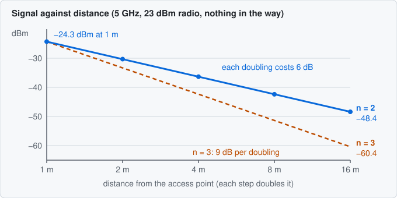
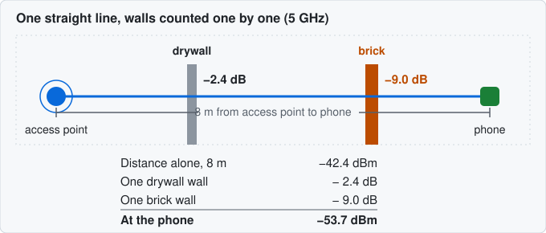
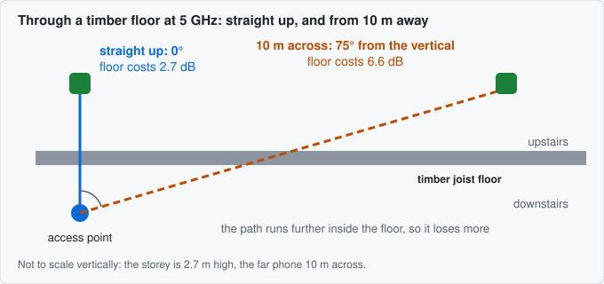
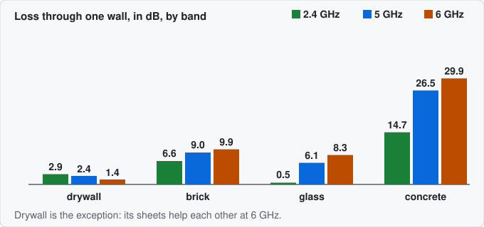
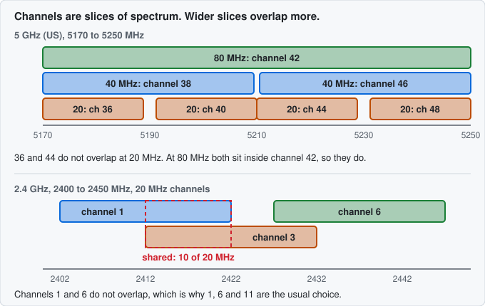
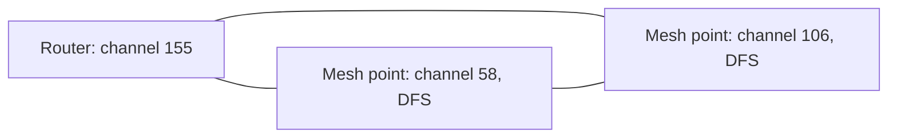
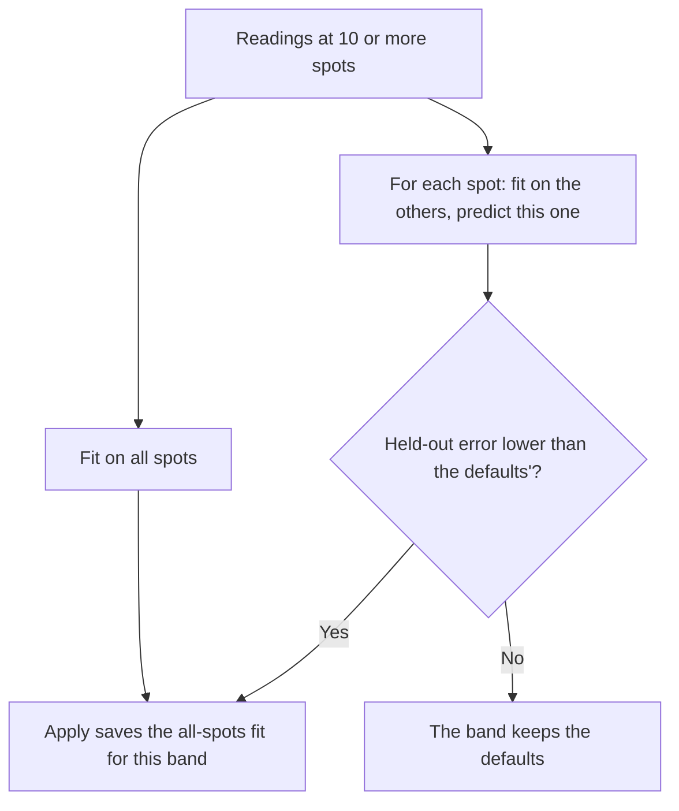
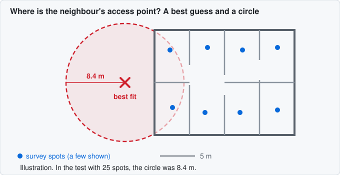
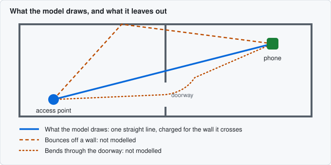

# How SignalPlan works

SignalPlan draws a map of the Wi-Fi signal in your home. **The gist:** the heatmap is a prediction worked out from your plan, not a measurement. It follows one straight line from each access point to each spot, and takes off an amount for distance and for every wall and floor in the way. The amounts come from published physics and measurements, but your walls may differ from the typical ones it assumes, and it ignores reflections, furniture and people. To find out how far to trust it in your home, measure a few spots and compare ([section 8](#8-checking-against-your-home)). The limits are in [section 11](#11-what-it-cant-do).

**Contents.** The prediction: [1 The heatmap](#1-what-the-heatmap-is) · [2 Distance](#2-distance-and-the-path-loss-exponent) · [3 Walls](#3-walls-materials-and-how-much-each-costs) · [4 Floors](#4-floors) · [5 Bands](#5-bands-why-24-5-and-6-ghz-differ). More than one access point: [6 Overlap and interference](#6-overlap-roaming-and-interference) · [7 Channels](#7-channels-and-the-planner). Checking it: [8 Against your home](#8-checking-against-your-home) · [9 Scanning](#9-scanning-your-network) · [10 Locating](#10-locating-neighbours-and-access-points). Honesty: [11 Limits](#11-what-it-cant-do) · [12 Where the numbers come from](#12-where-the-numbers-come-from).

**Units.** Signal strength is in **dBm**. The numbers are negative, and closer to zero is stronger: −40 dBm beats −60. A difference between two signals is in **dB**: 3 dB is double or half the power, and 10 dB is ten times.

Each section ends with a link to [MODEL.md](MODEL.md), which has the same story with the maths, the sources and the tests.

## 1. What the heatmap is

The heatmap is a **prediction**, not a measurement. SignalPlan doesn't listen to your Wi-Fi to draw it (unless you calibrate it, [section 8](#8-checking-against-your-home)). It takes the plan you drew, with its walls, floors and access points, and works out how strong each access point's signal should be at a point every 10 cm across each floor. It keeps the strongest and colours the point.

The colours step down at fixed levels: Excellent from −50 dBm, Good from −60, Fair from −67, Weak from −75 and Poor from −85. Below that a point is left uncoloured. The model assumes a phone held 1 m above the floor, with an antenna that neither boosts nor weakens the signal, which is typical of a phone.

The maths and sources: [MODEL.md › The equation](MODEL.md#the-equation) and [From equation to heatmap](MODEL.md#from-equation-to-heatmap).

## 2. Distance and the path loss exponent

Signal spreads out as it travels, so it weakens with distance, as a lamp looks dimmer across the room. In open air, every doubling of the distance costs 6 dB, three-quarters of the power. Doubling from 1 m to 2 m costs as much as doubling from 8 m to 16 m.

The steepness is set by the **path loss exponent**, written n. SignalPlan uses n = 2, the open-air value, because it counts walls one at a time and so doesn't need a bigger exponent to stand in for them. [Calibration](#8-checking-against-your-home) can change n to suit your home, within published limits.

In words, the prediction is: the access point's power, less the loss in the first metre, less 10 × n × the base-10 logarithm of the distance in metres, less the cost of every wall and floor in the way.

An example, for a 23 dBm radio on 5 GHz: −24.3 dBm at 1 m and −48.4 dBm at 16 m. With n = 3 it would be −60.4 dBm at 16 m, 12 dB lower.

The maths and sources: [MODEL.md › The equation](MODEL.md#the-equation).

## 3. Walls: materials and how much each costs

A wall takes some of the signal that crosses it, depending on what it's made of. SignalPlan has seven materials, each standing for a typical North American construction. Each wall's loss is calculated from its layers (drywall: plasterboard, air, plasterboard) using published electrical properties, not guessed. Two things are fitted to measurements because the standard falls short: the metal coating on low-E glass, and brick, whose standard value lost 1 to 5 dB less than a measured wall. Metal is capped at 40 dB, because real signal leaks round the edges.

| Material    | Loss per wall crossed, 5 GHz |
| ----------- | ---------------------------- |
| Wooden door | 1.8 dB                       |
| Drywall     | 2.4 dB                       |
| Glass       | 6.1 dB                       |
| Brick       | 9.0 dB                       |
| Concrete    | 26.5 dB                      |
| Low-E glass | 29.9 dB                      |
| Steel door  | 40 dB                        |

**The angle that matters.** A wall always costs its head-on loss, whatever angle the signal meets it at. Allowing for the angle changed a typical spot by half a decibel at most, so it isn't worth the extra complication for walls. Floors are different (next section).

An example from the picture: a phone 8 m from a 23 dBm access point on 5 GHz, with a drywall wall and a brick wall between them. Distance alone gives −42.4 dBm. The walls take 2.4 and 9.0 dB, so the phone sees −53.7 dBm. With concrete instead of brick it would see −71.3 dBm.

The maths and sources: [MODEL.md › Wall materials](MODEL.md#wall-materials), with the per-band numbers in [Loss per wall crossing](MODEL.md#loss-per-wall-crossing-db).

## 4. Floors

Between storeys the signal still takes one straight line and pays for each floor it crosses. What makes floors different from walls is the angle. A phone directly above the router has the signal cross the floor straight on. A phone in a room at the far end of the storey above gets a very slanting path, which spends longer inside the floor and loses more. Storeys are about 2.7 m high, so a phone 10 m across is reached at 75° from the vertical, which is shallow.

SignalPlan works out a floor's loss at the angle of each path, up to 75°. For a timber floor on 5 GHz that is 2.7 dB straight up, 4.2 dB at 60° and 6.6 dB at 75°. Past about 80° the loss climbs steeply, but real signal also finds other ways upstairs (a stairwell, a window, the edge of the slab), so the model stops at 75°. That cap is a judgement, not a measurement.

Stairwells and other openings you draw in a floor are skipped when the path goes through them. Roofs aren't modelled.

The maths and sources: [MODEL.md › Floor materials](MODEL.md#floor-materials), [Slabs at an angle](MODEL.md#slabs-at-an-angle) and [Signal between floors](MODEL.md#signal-between-floors).

## 5. Bands: why 2.4, 5 and 6 GHz differ

Higher frequencies lose more in two ways. They lose more in the first metre (40.2 dB on 2.4 GHz, 47.3 on 5 GHz and 48.7 on 6 GHz), and most walls cost more. Concrete costs about twice as much on 5 GHz as on 2.4. Glass is nearly invisible at 2.4 GHz because a 3 mm pane is tiny next to the 12 cm wavelength.

Drywall is the exception: its two sheets of plasterboard help each other at 6 GHz, so it costs less there than at 2.4 GHz.

So in this model 2.4 GHz reaches further through a home. The default radio power also differs by band: 20 dBm on 2.4 GHz, 23 dBm on 5 GHz and 18 dBm on 6 GHz. The first two are assumptions, typical of consumer routers and well under the legal limits. The 6 GHz one is the low-power indoor limit. You can set any radio's power in the plan.

An example: 10 m and one concrete wall, with each band's default power. On 2.4 GHz the phone sees −54.9 dBm. On 5 GHz it sees −70.8 dBm, 15.8 dB less, which moves that spot from Good to Weak.

The maths and sources: [MODEL.md › Bands](MODEL.md#bands) and [Loss per wall crossing](MODEL.md#loss-per-wall-crossing-db).

## 6. Overlap, roaming and interference

The heatmap can show four maps. The first, Signal, is the one above. The other three ask what happens when more than one access point is involved.

**Overlap** counts how many access points compete for a phone at each spot: those within 8 dB of the strongest and at or above −70 dBm. Where two or more count, a phone there could use either, which is what you want where it moves from one to another, and a waste where it doesn't. **Roaming** colours each spot by the access point a phone would be on (the strongest), and draws a line where that changes. Spots where none reaches −70 dBm are hatched grey. The 8 dB and −70 dBm are the figures Apple publishes for when an iPhone moves to another access point, used here as fixed defaults you can change per plan.

**Interference** shows, in dB, how far the strongest access point stands above everything else on the same airwaves (other access points, neighbours' networks and background noise). Where that gap is small, the signal is there but drowned out.

"The same airwaves" is the confusing part. A channel is a slice of the radio spectrum, and radios on slices that overlap interfere. On 2.4 GHz, channels 1 and 3 overlap by half, while 1 and 6 don't touch. On 5 GHz, wider channels are made by joining 20 MHz slices: two separate 20 MHz channels, 36 and 44, don't overlap, but an 80 MHz channel (42) covers both, so a radio on 42 clashes with either.

A wider channel picks up more background noise and overlaps more neighbours, so it pays twice. A radio whose channel is left on Auto is taken to be on a channel nobody else uses, the best case.

The maths and sources: [MODEL.md › Overlap and roaming](MODEL.md#overlap-and-roaming) and [Interference](MODEL.md#interference).

## 7. Channels and the planner

The channel planner suggests a channel, and a width where that's on Auto, for each radio. Think of colouring a map: two radios that can hear each other are neighbours, and neighbours need channels that don't overlap. Radios that hear each other at all take turns on the air, so overlapping channels cost speed. In a home most access points hear each other, so only thick walls, floors or low power keep two apart.

It searches for the best plan exhaustively. If a search grows too large it stops with the best plan found and says a better one may exist.

**Why DFS helps.** DFS is the rule that makes a router listen for radar and move off the channel. It's off unless you turn it on for the plan. Some channels need it. On US 5 GHz at 80 MHz there are six channels, of which only two (42 and 155) need no DFS. With three access points that all hear each other, two channels aren't enough and a clash is certain. With DFS on, the planner uses DFS channels only when that gives a better plan, and says why. With it off, it says when DFS would help.

This is the sample two-storey house with three access points, at 80 MHz on 5 GHz. They hear each other at −49 to −57 dBm, so all three are joined. With DFS allowed the planner finds a plan with no clashes: 155 for the router and 58 and 106 for the mesh points. With DFS off it gives the least-bad plan, with one clash between the two mesh points, and says allowing DFS would clear it. (With the width left on Auto and DFS off, it narrows to 40 MHz instead.)

It prefers, in order: fewest clashes, least overlap, least interference, then fewest DFS channels.

The maths and sources: [MODEL.md › Channel planner](MODEL.md#channel-planner) and [Channels and regions](MODEL.md#channels-and-regions).

## 8. Checking against your home

A model that has never met your home is a guess. To check it, take a reading at a spot with a Wi-Fi analyser on your phone and type it in, or [scan](#9-scanning-your-network). Each spot becomes a pin that shows how far the prediction was from the reading.

The **error** is the prediction minus the reading, so a positive error means the model expected more signal than you found. The error report gives, for each band, the average error (is the model biased high or low?) and the typical error (RMS: how far off a reading is, either way).

**Calibration** adjusts the model to your home. It fits a handful of numbers for each band: the exponent n, the loss of each wall material and floor that the readings cross, and one offset for your phone, since its antenna and your hand around it shift every reading alike. It needs at least 10 spots spread over at least half the rooms on each floor, and keeps every value within published limits.

How do you know it helped? Calibrate shows the error before and after as **held-out error**: each spot is predicted by a fit that didn't use it, so the figure can't improve just by memorising the readings.

On a synthetic surveyed home, in every band the typical error on held-out spots was 6.0–7.2 dB before calibrating and 1.9–2.8 dB after. No real home has been surveyed and calibrated yet.

The heatmap still shows what a perfect phone would see, without your phone's offset. So a phone that reads 5 dB low will still read about 5 dB below the heatmap afterwards.

The maths and sources: [MODEL.md › Survey readings](MODEL.md#survey-readings) and [Calibration](MODEL.md#calibration).

## 9. Scanning your network

Typing a reading for every spot is slow, so **Scan your network** reads the list of Wi-Fi networks your computer can hear. On Windows and macOS you paste a short script that the dialog shows you, which copies its result to your clipboard. For the built-in commands, you copy what they print. Either way you paste the result into SignalPlan, and nothing is sent anywhere.

The scan lists each radio's addresses (BSSIDs, one per network it broadcasts), names, channels and signal. You mark each network as **mine**, **a neighbour's** or **ignore**. Taken at a survey spot, your own networks' signals become that spot's readings, and the neighbours' are kept there for locating. Scan at three or more spots, mark each network, then locate the neighbours ([section 10](#10-locating-neighbours-and-access-points)) and plan channels ([section 7](#7-channels-and-the-planner)).

**Percent versus dBm.** Some tools give only a percentage, which isn't a physical unit, and each maps it to dBm differently. 60% is −70 dBm on Windows and about −64 dBm on Linux, 5.7 dB apart; the gap varies with the percentage. SignalPlan converts each with its own rule, marks the result as approximate with a ≈, and cautions in Calibrate when more than half the readings are approximate. The scripts give dBm directly.

An iPhone can't export a scan: read each network's signal in AirPort Utility's Wi-Fi Scanner and type it in with the Survey tool.

The maths and sources: [MODEL.md › Survey readings](MODEL.md#survey-readings) and [Locating access points](MODEL.md#locating-access-points). The conversions are recorded in [D79](DECISIONS.md#d79-reading-scans--2026-10-03).

## 10. Locating neighbours and access points

From scans at several spots, SignalPlan can work out where a neighbour's access point is, and so how much it disturbs each room. The signal at each spot is a clue about how far away the source is, and a few clues from different places narrow it down. It needs three spots or more. SignalPlan tries positions on every floor, picks the one whose predicted signals best match your readings, and works out the access point's power at the same time.

The answer comes with a circle. The **uncertainty circle** takes in every position that fits the readings nearly as well as the best one. The true spot should be inside it about 19 times in 20. It's never a single point, because SignalPlan assumes every reading may be off by about 3 dB, which is roughly what remains after calibration.

In tests with known positions, 25 spots placed a neighbour to within about 1 m and 6 spots to about 3.4 m (typical errors), and the true spot was always inside the circle, which is usually 2–9 times bigger than the real error. More spots, nearer the source, shrink it.

Its limits are the model's. A source behind a lossy wall reads stronger than predicted and is placed nearer. A weak source close by and a strong one further off can look alike, which shows as a bigger circle. Because it is one radius, the circle can't show that you're sure in one direction but not another.

Once a neighbour has a location, the Interference view and the channel planner treat it as a real place: strong near its wall, faint at the far end of the house, rather than the same everywhere. The same fit can check one of your own access points against its readings.

The maths and sources: [MODEL.md › Locating access points](MODEL.md#locating-access-points).

## 11. What it can't do

The model draws one straight line from each access point to each point, and knows nothing that isn't in the plan.

- **No bounces or bends.** Reflections and signal bending round corners are ignored, so areas behind strong walls are predicted darker than they are.
- **Typical constructions.** A real wall may differ from its type. Metal studs, foil-backed insulation, tile or plaster lath all add loss, and real wood measured up to 5 dB lossier than the model.
- **Dampness.** Concrete's loss depends hugely on how wet it is. The model assumes fairly damp concrete, so a dry wall above ground is probably predicted too lossy.
- **Antennas.** Every access point is treated as sending evenly in all directions, and your phone as a perfect receiver. A real phone, and your hand around it, may read several dB lower.
- **No furniture or people.**
- **The channel planner trusts the model's signal between access points.** A neighbour you haven't located counts as heard everywhere at one strength.

The model's checks against published measurements are in [Validation](MODEL.md#validation).

The maths and sources: [MODEL.md › Known limits](MODEL.md#known-limits).

## 12. Where the numbers come from

- **Calculated** from published material properties: wall and floor losses.
- **Fitted to one measurement:** low-E glass and brick.
- **Taken from rules:** channels, power limits, DFS, and Apple's roaming figures.
- **From the model's own tests:** the 3 dB scatter for locating.
- **Judgement, labelled as such:** default power, the 75° cap and the 1, 6 and 11 rule.

MODEL.md says where each number comes from and lists every source at the bottom, and the decisions behind the choices are in [DECISIONS.md](DECISIONS.md).

The maths and sources: [MODEL.md › Sources](MODEL.md#sources).
