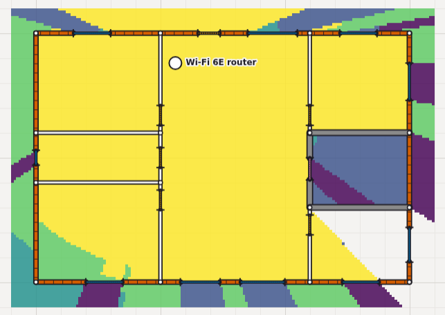
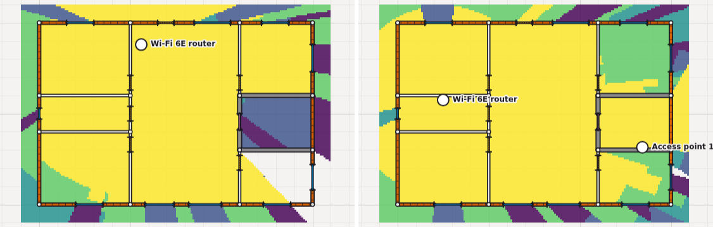
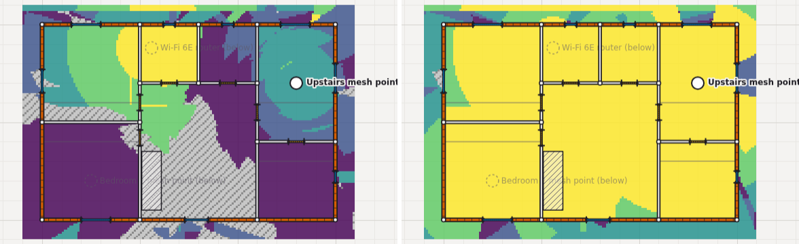
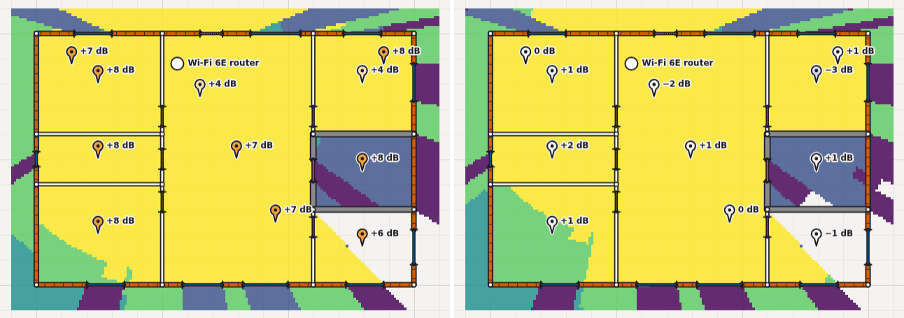

# Predicting home Wi-Fi from a floor plan, and how far to trust it

[AUTHOR: why you built this; e.g. "I wanted to know where to put a router, and how many access points a house needs, without a survey kit."]

A survey needs the access points already installed, so it can't tell you what to buy. Professional tools such as Ekahau and Hamina do predictive planning, but they're priced and built for enterprise Wi-Fi engineers. I wanted the same kind of model for a house, free, in a browser, with the physics written down where you can check it. SignalPlan is what came out: a free, open-source browser app ([signalplan.pages.dev](https://signalplan.pages.dev), MIT) where you draw the plan to scale, see the predicted signal everywhere, and let an optimizer search for placements. No account, and plans stay on your device.

One fact first. **No real home has been surveyed or scanned with it yet.** The model is checked against published lab measurements, an ITU-R indoor model and synthetic homes whose readings the model itself generated. That shows the machinery works, not that the predictions are right in your house. The real-home checks, [#132](https://github.com/NC4321/SignalPlan/issues/132) and [#144](https://github.com/NC4321/SignalPlan/issues/144), are still open. So this is a write-up of the model and how I tested it, and a request for real-home data.

## The model

The prediction at a point is one line[^eq]:

> P_rx = EIRP − [ PL(1 m) + 10·n·log₁₀(d) + Σ L_wall ]

PL(1 m) is free-space loss at one metre (47.3 dB on 5 GHz), and with n = 2 each doubling of distance costs 6 dB. Each wall the straight line from access point to point crosses adds its loss. The defaults of 20 and 23 dBm of transmit power on 2.4 and 5 GHz are assumptions; 18 dBm on 6 GHz is the low-power indoor limit in a 20 MHz channel[^bands]. The receiver is 0 dBi and 1 m up, roughly a phone. Walls are counted one at a time, so n stays at the free-space value: a larger empirical exponent would already include them, as in the COST 231 multi-wall model[^cost]. The strongest access point wins each cell of a 10 cm grid.

### Walls are computed, not looked up

Each material is built as layers (drywall: 12.7 mm plasterboard, 89 mm of air, 12.7 mm plasterboard), with permittivity and conductivity from ITU-R P.2040-4 and its multi-layer slab method, which handles reflection at every surface. The result is averaged over both polarisations and 25 frequencies across the band, which smooths thickness resonances[^walls]. At 5 GHz that gives drywall 2.4 dB, brick veneer 9.0 and 200 mm concrete 26.5[^losses].

Two numbers are fitted, not computed: a low-E coating's sheet resistance, to reproduce 29.7 dB measured at 6.75 GHz, and brick's conductivity, because P.2040's brick lost 1–5 dB less than a measured wall[^fitted]. Metal is capped at 40 dB, since real signal leaks round the edges of doors.

_Figure 1. The sample home at 5 GHz, router at the top. Yellow is −50 dBm or stronger; green, teal, blue and purple step down through −60, −67, −75 and −85, and white is below −85. The utility room has concrete walls and a steel door. At (13.05, 5.55) inside it the signal is −69.5 dBm: free space over 8.63 m gives −43.0, less 26.5 for the concrete. The dark stripe is the steel door: 10 cm apart across the wall, the prediction drops from −41.1 to −81.2 dBm. Real signal won't fall off a 40 dB cliff like that: diffraction round the door frame softens it. It's the sharpest artefact of a one-ray model._[^shadow]

### Floors depend on the angle; walls don't

A path to another floor pays for each slab it crosses[^floors], at the angle it meets the slab, up to 75° from the vertical[^angle]. A path to the next floor rises about 2.7 m but usually travels several metres sideways, so it crosses the floor at a shallow angle: 10 m across is 75°. On 5 GHz the timber floor loses 2.7 dB head-on and 6.6 dB at 75°. Charging the head-on loss left the upper floor 2.3 and 5.5 dB optimistic against ITU-R P.1238-13 at 2.4 and 5 GHz; with the angle, 0.7 and 3.4 dB. Walls stay head-on, because angle-dependent wall loss moved the median cell of two test homes by at most 0.5 dB[^d30]. The 75° cap is a judgement, not a measurement: past about 80° the computed loss climbs steeply, and real signal finds the stairwell or a window instead.

### What it was checked against

Apart from those two fits, the losses are predicted, then compared with published measurements using each sample's own thickness[^valid].

- **Shakya et al., 6.75 GHz:** within 4 dB on all six samples, one of them the fitted window.
- **NIST, 5 and 6 GHz:** drywall and glass within 2.3 dB; at 2.0 GHz, the nearest it measured to 2.4, within 1 dB.
- **P.1238-13 indoor model:** with the one or two interior walls a path typically crosses at these distances, free space plus drywall is within about 3 dB of its office median at 5, 10 and 20 m.
- **P.1238-13 across floors,** two-storey home: median gaps of +0.7 and −0.8 dB on the main floor and −0.7 and −3.4 dB upstairs (2.4 and 5 GHz), against a 10 dB limit. The reference joins two parts of P.1238 that weren't fitted together, so it's a sanity check[^gate3].

The failures matter more. Against NIST, masonry loses far more than modelled even after the brick fit: 7.5–8.3 dB more for one wythe of brick, and 28–30 dB more for 203 mm of concrete at 5 GHz (26.9 modelled, 54.6–57.2 measured). Part of that is moisture: putting an MIT thesis's measured permittivities for one concrete mix into the same slab calculation gives 203 mm of it 3.6 dB oven-dried and 50.8 dB wet, and P.2040's concrete behaves like the saturated case, 29.7[^moisture]. Wood is under-predicted in every source, by 0.3 to 5 dB.

## Why not ray tracing

One straight line per cell ignores reflection and diffraction, so areas behind strong walls are predicted darker than they are[^limits]. Ray tracing would handle that. I chose not to, for reasons in the decision log[^d24]: there is no router data to source antenna patterns from, multi-wall is the standard citable approach, and one wall check per cell is cheap enough to redraw while you drag an access point. A 300 m² house with 60 walls and two access points takes a median 11.5 ms on the development machine, against a 50 ms budget[^speed].

The cost is that signal going round a corner is missed, and the channel planner can think two access points can't hear each other when reflections let them. Separately, multipath makes a real reading swing by several dB over a few centimetres. The map is a local mean, not what a phone sees at one exact spot, which is why survey readings at a spot are averaged[^survey]. I'd revisit if calibration shows consistent error behind strong walls.

## The optimizer

It maximises one number: the share of the floor that reaches a target signal. It's the same coverage percentage the app shows in its status bar, so the before and after you see are what was optimized. Every square metre inside the outer walls counts the same[^opt].

**One access point.** Candidates are a 0.5 m lattice inside the walls, at least 10 cm from any wall, scored on 25 cm cells. The best five are refined by pattern search at 0.25 m and then 0.1 m, and the winner is chosen on the 10 cm grid. Ties go to the spot whose weakest cell is strongest[^single].

**Several.** Added access points go in one at a time at the best lattice spot. A second start places every movable one that way, and the better start is refined by simulated annealing: 250 steps per access point, shrinking from 2 m to 10 cm, with one step in five jumping to a random lattice spot. The second start matters: from the current layout alone, the sample home's router reached 90.9% against 92.0%[^multi].

**How many do I need?** The same search runs with 0, 1, 2 and so on added, up to four, and stops at the first count that reaches your goal (80 to 100% of the floor, 90% by default), all within one 10 s budget. If that runs out the app says so, rather than claiming the goal is out of reach[^many].

_Figure 2. The sample home at Fair or better (−67 dBm) on 5 GHz. Yellow and green both meet the target; the uncoloured patch is below −85 dBm. Left: the router by the front door covers 86.9% of the 150 m². Right: after "Find a better spot" (92.0%) and then "Suggest one more access point", 100%._[^opt-results]

**Benchmarks.** My acceptance test compares the single-access-point search with a router in the middle of the floor (moved to the nearest allowed spot where the middle is a wall or outside it). It uses a stricter target, Good (−60 dBm), than Figure 2, so the numbers differ; at that target a middle router falls short in every home. The suggestion must cover a strictly larger share[^gate]:

| Home                   | As drawn | In the middle | Suggested | Gain over middle |
| ---------------------- | -------- | ------------- | --------- | ---------------- |
| Sample home, 150 m²    | 86.8%    | 87.4%         | 90.5%     | 3.1 points       |
| Apartment, 65 m²       | 57.3%    | 72.1%         | 97.4%     | 25.3 points      |
| L-shaped house, 220 m² | 53.3%    | 75.6%         | 100%      | 24.4 points      |

The gain is small where the middle is decent and large where it sits behind a strong wall. That is also the limit of the evidence: the tests compare against the middle of the floor, check invariants and check known answers on small toy rooms. None compares against an exhaustive search or a person's choice, so it finds good spots for this model, not guaranteed best ones. A single-router search takes 0.05–1.19 s on the development machine across five test homes; the slowest, a two-storey how-many search, takes 3.86 s. On a phone, which I estimate at four to six times slower (not measured), that would be about 15–23 s, so the search stops at 10 s and says so[^optspeed].

## Channels

Choosing channels is graph colouring. Radios are nodes, joined when either hears the other at or above the clear-channel-assessment level for its width: −82, −79, −76 and −73 dBm for 20, 40, 80 and 160 MHz (IEEE 802.11ac-2013). Above that a receiver treats the channel as busy, so the two take turns. At 23 dBm on 5 GHz, free-space signal stays above −76 dBm out to about 385 m[^cca], so nearly every pair in a home is joined. A clash is two joined radios on overlapping channels, or a radio overlapping a neighbour's network at or above that level. The search is exact up to 20,000 choices per band and width, beyond which the planner says a better plan may exist[^planner].

In my acceptance test, a three-access-point two-storey home at 80 MHz on 5 GHz has a clash-free plan only if DFS channels are allowed; without them one clash is unavoidable, and the planner says so[^cgate].

_Figure 3. Upper floor, signal to interference and noise on 5 GHz at 80 MHz. Left, planned without DFS: hatched grey (19% of the floor) is too noisy for any rate. Right, with DFS: none. Yellow here means 39 dB or better, enough for Wi-Fi 6's top rate._[^sinr]

## Checking against reality

You can click where you measured and type the signal in dBm, or import a file, and the app reports the error, predicted minus measured, per reading and band.

"Calibrate" then fits the model to the home by bounded least squares in dB, one band at a time: the exponent n, one offset for the phone, and the loss of each wall and floor material that at least 5 readings from 3 spots cross. Every value stays within limits from published sources: the exponent from 1.47 to 2.39 (P.1238-13's office values), and the offset within ±30 dB, which is an inference from a paper comparing Wi-Fi chipsets[^limits-cal]. The before and after errors are leave-one-spot-out, so a lower error means the model improved rather than memorised, and "Apply" only saves bands that beat the defaults[^held].

_Figure 4. The surveyed test bungalow on 5 GHz; each pin is predicted minus measured at that spot. Left: defaults, +4 to +8 dB. Right: after "Calibrate" and "Apply", −3 to +2 dB. The readings are synthetic: the model with n = 2.25, a phone reading 5 dB low and 2 dB of noise._[^cgate2]

**The synthetic results, honestly.** On that bungalow the held-out RMS error falls from 6.0–7.2 dB to 1.9–2.8 dB across the three bands. On a two-storey home with its walls, floor and exponent set off their defaults, and 3 dB of noise, it falls from 6.8–10.0 dB to 2.7–3.4 dB[^cgate2]. But the readings came from the same model, so this shows the fit finds what is there, not that a real home looks like the model. And with 3 dB of noise, n ranged from 1.7 to 2.39 over eight surveys of a home whose true n was 2.2, because n and the phone's offset trade off[^recover].

## Scans, and locating neighbours

"Scan your network" reads the output of `netsh`, `system_profiler`, `nmcli`, `iw`, WiFi Analyzer or SignalPlan's own script. Networks you mark as yours become survey readings and the rest become neighbours[^scan]. A neighbour heard at three or more spots can be located by fitting its position and power with the same model, and then interferes cell by cell instead of at one strength everywhere[^locate]. The position comes with a deliberately conservative radius: it held the true position in all 600 noisy synthetic surveys, at the price of being typically 2–9 times the real error (a median error of 0.6–0.9 m with 25 spots, and a median radius of 2.6–8.4 m)[^locres]. In my acceptance test, two neighbours just outside a three-access-point home's walls were each located on the right floor within their radius, and with them located the planner finds a plan with no clash where counting each at its strongest everywhere leaves 3[^sgate]. All of this is on synthetic scans.

## Real-home results

> [AUTHOR: real-home results go here once #132 and #144 are done]

Until then, read every accuracy figure above as agreement with lab data and with the model itself. Real scan captures and a scan of an actual home are still to do[^real].

## What it can't do

- **Reflection and diffraction.** Shadows behind strong walls are too dark, and the planner can misjudge which access points hear each other[^limits2].
- **Typical constructions.** A real wall may be metal-studded or foil-backed, and every wall of one material shares one loss, so calibration can't fix one particular wall.
- **Antennas, furniture and people.** Access points are omnidirectional, and a phone may read several dB below the assumed 0 dBi.
- **Uplink.** Everything is router-to-phone. A phone transmits at much lower power than a router, so at the edge of coverage the return link can fail first[^limits].
- **The optimizer** works on one band at a time, ignores backhaul (a mesh node placed far away may have a weak link), has no no-go zones, and can miss the best layout.
- **Calibration** is per home, only as good as the survey, and its offset belongs to one phone.

## What's next

The real-home checks decide whether any of this holds in a house, and that's where I'd most like help. If you have a survey of your own home (Ekahau, NetSpot, or just a phone and a notebook), and a floor plan, I'd love to compare. [AUTHOR: where to send it / what feedback you want.] Try it at [signalplan.pages.dev](https://signalplan.pages.dev). If you want the equations, `docs/MODEL.md` has each one with its source, and `docs/DECISIONS.md` has the reasoning behind each choice.

_Figures are regenerated by scripts/writeup-figures.mjs._

[^eq]: [MODEL.md › The equation](https://github.com/NC4321/SignalPlan/blob/main/docs/MODEL.md#the-equation) and [From equation to heatmap](https://github.com/NC4321/SignalPlan/blob/main/docs/MODEL.md#from-equation-to-heatmap): the 10 cm grid, the strongest access point, 3D distance, receiver 1 m up. 6 dB per doubling is 20·log₁₀2 = 6.02.

[^bands]: [MODEL.md › Bands](https://github.com/NC4321/SignalPlan/blob/main/docs/MODEL.md#bands): PL(1 m) 40.2 / 47.3 / 48.7 dB, default EIRP 20 / 23 dBm marked there as assumptions, and 18 dBm the 6 GHz low-power indoor limit in a 20 MHz channel.

[^cost]: [D24](https://github.com/NC4321/SignalPlan/blob/main/docs/DECISIONS.md#d24-propagation-scope-for-m1-omnidirectional-direct-path-only--2026-09-27) and [MODEL.md](https://github.com/NC4321/SignalPlan/blob/main/docs/MODEL.md#from-equation-to-heatmap) ("a multi-wall model, as in the COST 231 final report", with the free-space exponent).

[^walls]: [MODEL.md › Wall materials](https://github.com/NC4321/SignalPlan/blob/main/docs/MODEL.md#wall-materials) (method and constructions) and [D9](https://github.com/NC4321/SignalPlan/blob/main/docs/DECISIONS.md#d9-wall-losses-are-computed-from-itu-r-p2040--2026-09-27). Code: `slab.ts`, `materials.ts`.

[^losses]: [MODEL.md › Loss per wall crossing](https://github.com/NC4321/SignalPlan/blob/main/docs/MODEL.md#loss-per-wall-crossing-db), pinned by [`materials.test.ts`](https://github.com/NC4321/SignalPlan/blob/main/packages/engine/src/materials.test.ts). Drywall 2.9 / 2.4 / 1.4 dB, glass 0.5 / 6.1 / 8.3 dB at 2.4 / 5 / 6 GHz.

[^fitted]: Low-E: 9.1 Ω/sq against Shakya et al.'s 29.7 dB at 6.75 GHz; brick: σ = 0.0170·f^0.92 S/m against Muqaibel's wall ([MODEL.md › Wall materials](https://github.com/NC4321/SignalPlan/blob/main/docs/MODEL.md#wall-materials), [D36](https://github.com/NC4321/SignalPlan/blob/main/docs/DECISIONS.md#d36-brick-conductivity-fitted-to-a-measured-wall--2026-09-28)). Metal's cap is the same page; Shakya et al. measured 43.2 dB through a steel door.

[^shadow]: Router at (5.6, 1.2) to the cell at (13.05, 5.55), both 1 m up: d = 8.63 m, and 23 − 47.29 − 20·log₁₀(8.63) = −43.0 dBm; less the 26.5 dB concrete loss ([losses](https://github.com/NC4321/SignalPlan/blob/main/docs/MODEL.md#loss-per-wall-crossing-db)) gives −69.5, and the engine's grid cell there is −69.49 dBm. The door is `utility-door` in [`sample-home.json`](https://github.com/NC4321/SignalPlan/blob/main/packages/floorplan/fixtures/sample-home.json), metal, capped at 40 dB; the cells at (10.95, 5.55) and (11.05, 5.55) read −41.1 and −81.2 dBm. Colour bands: [D12](https://github.com/NC4321/SignalPlan/blob/main/docs/DECISIONS.md#d12-heatmap-colours--2026-09-27).

[^floors]: [MODEL.md › Floor materials](https://github.com/NC4321/SignalPlan/blob/main/docs/MODEL.md#floor-materials) and [Signal between floors](https://github.com/NC4321/SignalPlan/blob/main/docs/MODEL.md#signal-between-floors).

[^angle]: [MODEL.md › Slabs at an angle](https://github.com/NC4321/SignalPlan/blob/main/docs/MODEL.md#slabs-at-an-angle) and [D60](https://github.com/NC4321/SignalPlan/blob/main/docs/DECISIONS.md#d60-slab-loss-follows-the-paths-angle--2026-09-28): timber 2.7 dB at 0° and 6.6 dB at 75° on 5 GHz; 2.3 / 5.5 dB before and 0.7 / 3.4 dB after, against P.1238-13.

[^d30]: [D30](https://github.com/NC4321/SignalPlan/blob/main/docs/DECISIONS.md#d30-wall-loss-stays-at-normal-incidence--2026-09-27): median cell moved by at most 0.5 dB, 90% of cells by about 3 dB, on the sample home and the big house.

[^valid]: [MODEL.md › Validation](https://github.com/NC4321/SignalPlan/blob/main/docs/MODEL.md#validation), with its sources, tested in [`materials.test.ts`](https://github.com/NC4321/SignalPlan/blob/main/packages/engine/src/materials.test.ts). The P.1238 comparison is MODEL.md's table of free space plus one and two drywall walls.

[^gate3]: [MODEL.md › Exit gate (D58)](https://github.com/NC4321/SignalPlan/blob/main/docs/MODEL.md#floors-and-their-limits), checked by [`m3Gate.test.ts`](https://github.com/NC4321/SignalPlan/blob/main/packages/engine/src/m3Gate.test.ts). The test limit is 2σ, 10 dB, over cells 4–30 m from the router.

[^moisture]: [MODEL.md › Masonry and wood: second sources](https://github.com/NC4321/SignalPlan/blob/main/docs/MODEL.md#masonry-and-wood-second-sources) (Rhim's permittivities for one mix, 203 mm at 5 GHz: 3.6 dB oven dried, 29.7 saturated, 50.8 wet) and [D36](https://github.com/NC4321/SignalPlan/blob/main/docs/DECISIONS.md#d36-brick-conductivity-fitted-to-a-measured-wall--2026-09-28). NIST's brick and concrete rows: [MODEL.md › Against NIST](https://github.com/NC4321/SignalPlan/blob/main/docs/MODEL.md#against-nist-at-5-and-6-ghz).

[^limits]: [MODEL.md › Known limits](https://github.com/NC4321/SignalPlan/blob/main/docs/MODEL.md#known-limits), including its downlink-only entry.

[^d24]: [D24](https://github.com/NC4321/SignalPlan/blob/main/docs/DECISIONS.md#d24-propagation-scope-for-m1-omnidirectional-direct-path-only--2026-09-27): antenna patterns lack data, multi-wall is the citable approach, one wall check per cell fits the 200 ms budget ([D11](https://github.com/NC4321/SignalPlan/blob/main/docs/DECISIONS.md#d11-grid-resolution--2026-09-27)). The revisit condition is in the same entry.

[^speed]: [MODEL.md › Speed](https://github.com/NC4321/SignalPlan/blob/main/docs/MODEL.md#speed), [D29](https://github.com/NC4321/SignalPlan/blob/main/docs/DECISIONS.md#d29-heatmap-speed-on-slow-devices--2026-09-27) (budgets) and [D56](https://github.com/NC4321/SignalPlan/blob/main/docs/DECISIONS.md#d56-walls-sorted-by-direction-from-each-access-point--2026-09-28) (256 sectors, 5,000 random layouts).

[^opt]: [MODEL.md › Placement optimizer](https://github.com/NC4321/SignalPlan/blob/main/docs/MODEL.md#placement-optimizer), [D40](https://github.com/NC4321/SignalPlan/blob/main/docs/DECISIONS.md#d40-placement-optimizer-scope-for-m2--2026-09-28), [D41](https://github.com/NC4321/SignalPlan/blob/main/docs/DECISIONS.md#d41-optimizer-scoring-and-candidate-positions--2026-09-28). Constants in the code: `SEARCH_CELL_M`, `CANDIDATE_SPACING_M` and `WALL_CLEARANCE_M` in [`placement.ts`](https://github.com/NC4321/SignalPlan/blob/main/packages/engine/src/placement.ts). 150 m² ÷ 0.25² = 2,400 cells; ÷ 0.5² = 600 candidates.

[^single]: [D42](https://github.com/NC4321/SignalPlan/blob/main/docs/DECISIONS.md#d42-single-access-point-search--2026-09-28) and `REFINE_COUNT`, `REFINE_STEPS_M` in [`search.ts`](https://github.com/NC4321/SignalPlan/blob/main/packages/engine/src/search.ts).

[^multi]: [D45](https://github.com/NC4321/SignalPlan/blob/main/docs/DECISIONS.md#d45-multi-access-point-search--2026-09-28) and `ANNEAL_STEPS_PER_AP`, `ANNEAL_SEED`, `JUMP_CHANCE`, `ANNEAL_START_STEP_M` in [`multiSearch.ts`](https://github.com/NC4321/SignalPlan/blob/main/packages/engine/src/multiSearch.ts).

[^many]: [D46](https://github.com/NC4321/SignalPlan/blob/main/docs/DECISIONS.md#d46-how-many-access-points-do-i-need--2026-09-28); `MAX_ADDED` = 4 and the 10 s `SEARCH_BUDGET_MS` are in `multiSearch.ts` and `search.ts`.

[^opt-results]: Moving the router takes 86.9% to 92.0% (0.37 s), and adding one to the original layout reaches 100% (0.5 s), whereas the figure moves the router first and then adds one: [D45](https://github.com/NC4321/SignalPlan/blob/main/docs/DECISIONS.md#d45-multi-access-point-search--2026-09-28) and [MODEL.md](https://github.com/NC4321/SignalPlan/blob/main/docs/MODEL.md#placement-optimizer).

[^gate]: [`exitGate.test.ts`](https://github.com/NC4321/SignalPlan/blob/main/packages/engine/src/exitGate.test.ts) and the table in [MODEL.md › Placement optimizer](https://github.com/NC4321/SignalPlan/blob/main/docs/MODEL.md#placement-optimizer) (Exit gate, D47); the toy-room checks are in `search.test.ts`. Gains: 90.5 − 87.4, 97.4 − 72.1 and 100 − 75.6.

[^optspeed]: [MODEL.md › Placement optimizer](https://github.com/NC4321/SignalPlan/blob/main/docs/MODEL.md#placement-optimizer) (its Speed table, i5-12600K), from `optimizer.speed.ts`. The 15–23 s is 3.86 s × 4–6; [D29](https://github.com/NC4321/SignalPlan/blob/main/docs/DECISIONS.md#d29-heatmap-speed-on-slow-devices--2026-09-27) says slow-phone times are the desktop's × 4–6, not measured.

[^cca]: [MODEL.md › Channel planner](https://github.com/NC4321/SignalPlan/blob/main/docs/MODEL.md#channel-planner). Range: 23 − 47.3 + 76 = 51.7 dB of path loss, so d = 10^(51.7/20) ≈ 385 m.

[^planner]: [D68](https://github.com/NC4321/SignalPlan/blob/main/docs/DECISIONS.md#d68-channel-planner--2026-09-29), [MODEL.md › Channel planner](https://github.com/NC4321/SignalPlan/blob/main/docs/MODEL.md#channel-planner); the 20,000-choice limit and the brute-force check are in MODEL.md and `channelPlan.test.ts`.

[^cgate]: [`channelGate.test.ts`](https://github.com/NC4321/SignalPlan/blob/main/packages/engine/src/channelGate.test.ts) and [D69](https://github.com/NC4321/SignalPlan/blob/main/docs/DECISIONS.md#d69-phase-6-exit-gate--2026-09-29), checked against brute force over every assignment of the channels the planner may use.

[^sinr]: [MODEL.md › Interference](https://github.com/NC4321/SignalPlan/blob/main/docs/MODEL.md#interference) (the 39.0 dB and 9.0 dB bands).

[^survey]: [MODEL.md › Survey readings](https://github.com/NC4321/SignalPlan/blob/main/docs/MODEL.md#survey-readings) and [D72](https://github.com/NC4321/SignalPlan/blob/main/docs/DECISIONS.md#d72-importing-survey-readings--2026-09-29): ITU-R P.1057-7 §5 for Rayleigh fading; 10·log₁₀(e)·γ = 4.343 × 0.5772 = 2.5 dB.

[^limits-cal]: [MODEL.md › Calibration](https://github.com/NC4321/SignalPlan/blob/main/docs/MODEL.md#calibration) and `calibrationLimits.test.ts`; [D75](https://github.com/NC4321/SignalPlan/blob/main/docs/DECISIONS.md#d75-the-calibration-fit--2026-09-29), which records that the ±30 dB is an inference from Lui et al. (2011).

[^held]: [D76](https://github.com/NC4321/SignalPlan/blob/main/docs/DECISIONS.md#d76-calibrate-suggest-preview-and-apply--2026-10-03).

[^cgate2]: [`calibrationGate.test.ts`](https://github.com/NC4321/SignalPlan/blob/main/packages/engine/src/calibrationGate.test.ts), [D78](https://github.com/NC4321/SignalPlan/blob/main/docs/DECISIONS.md#d78-phase-7-exit-gate--2026-10-03) and [MODEL.md › Exit gate](https://github.com/NC4321/SignalPlan/blob/main/docs/MODEL.md#calibration) (the bungalow is [`surveyed-home.json`](https://github.com/NC4321/SignalPlan/blob/main/packages/floorplan/fixtures/surveyed-home.json)).

[^recover]: [MODEL.md › Calibration](https://github.com/NC4321/SignalPlan/blob/main/docs/MODEL.md#calibration), "How well it recovers a known home", and [D75](https://github.com/NC4321/SignalPlan/blob/main/docs/DECISIONS.md#d75-the-calibration-fit--2026-09-29) and [D76](https://github.com/NC4321/SignalPlan/blob/main/docs/DECISIONS.md#d76-calibrate-suggest-preview-and-apply--2026-10-03).

[^scan]: [D77](https://github.com/NC4321/SignalPlan/blob/main/docs/DECISIONS.md#d77-scope-for-phase-8-scan-your-network--2026-10-03), [D79 to D82](https://github.com/NC4321/SignalPlan/blob/main/docs/DECISIONS.md#d79-reading-scans--2026-10-03).

[^locate]: [MODEL.md › Locating access points](https://github.com/NC4321/SignalPlan/blob/main/docs/MODEL.md#locating-access-points), [D83](https://github.com/NC4321/SignalPlan/blob/main/docs/DECISIONS.md#d83-locating-access-points-from-readings--2026-10-04) and [D84](https://github.com/NC4321/SignalPlan/blob/main/docs/DECISIONS.md#d84-located-neighbours-interfere-cell-by-cell--2026-10-04). The 2–9 times is in D83.

[^locres]: [MODEL.md › Locating access points, Validation](https://github.com/NC4321/SignalPlan/blob/main/docs/MODEL.md#locating-access-points), from the validation run for D83 (`locate.test.ts`).

[^sgate]: [`scanGate.test.ts`](https://github.com/NC4321/SignalPlan/blob/main/packages/engine/src/scanGate.test.ts) and [D86](https://github.com/NC4321/SignalPlan/blob/main/docs/DECISIONS.md#d86-phase-8-exit-gate-automated-part--2026-10-04).

[^real]: [D78](https://github.com/NC4321/SignalPlan/blob/main/docs/DECISIONS.md#d78-phase-7-exit-gate--2026-10-03) and [D86](https://github.com/NC4321/SignalPlan/blob/main/docs/DECISIONS.md#d86-phase-8-exit-gate-automated-part--2026-10-04): #132 and #144 stay open for a real survey and real captures.

[^limits2]: [MODEL.md › Known limits](https://github.com/NC4321/SignalPlan/blob/main/docs/MODEL.md#known-limits), [Placement optimizer › Limits](https://github.com/NC4321/SignalPlan/blob/main/docs/MODEL.md#placement-optimizer), [Floors and their limits](https://github.com/NC4321/SignalPlan/blob/main/docs/MODEL.md#floors-and-their-limits) and [What calibration can't do](https://github.com/NC4321/SignalPlan/blob/main/docs/MODEL.md#calibration).
